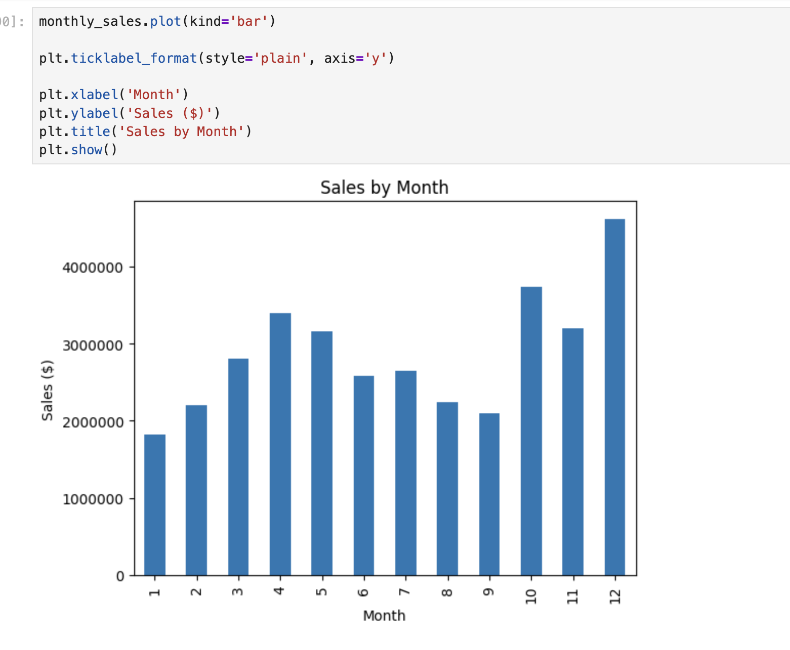
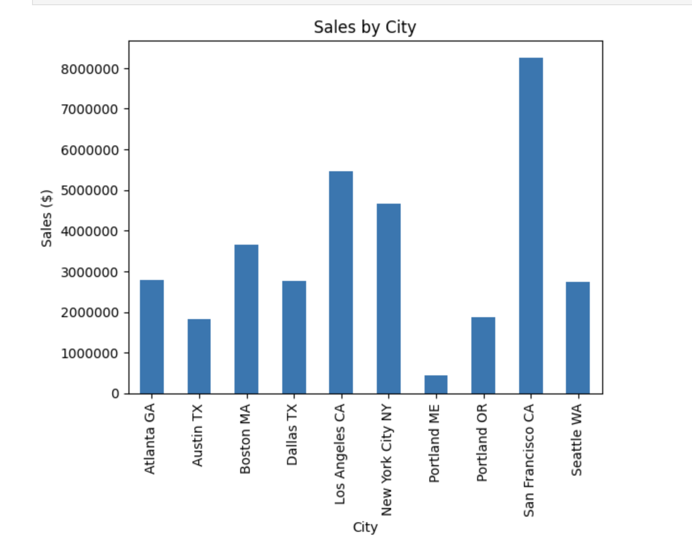
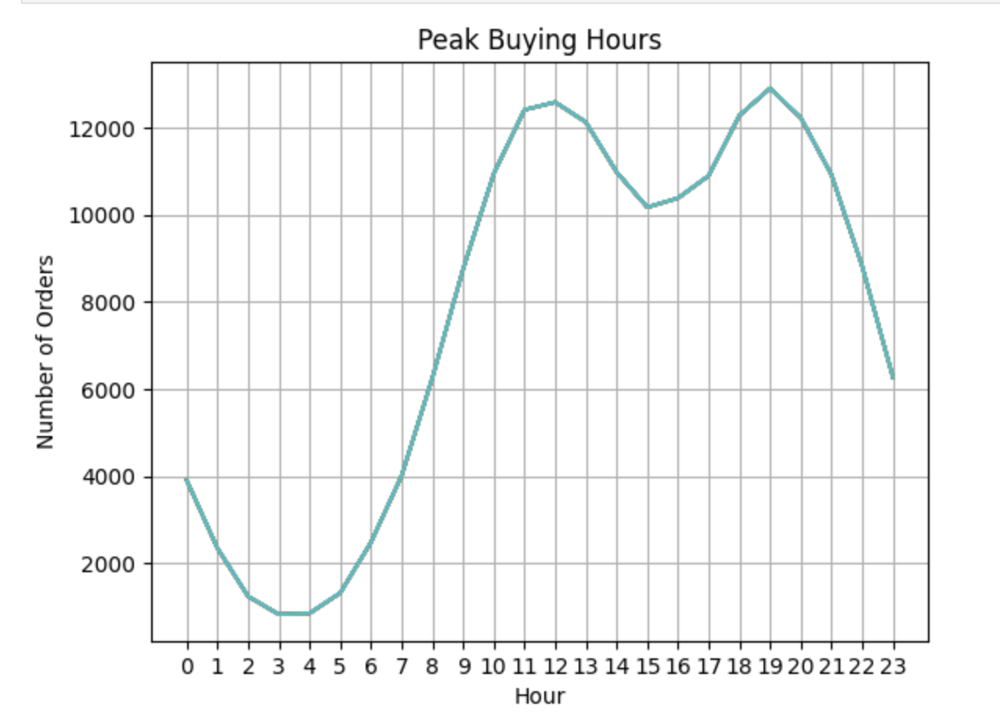

# Retail Sales Data Analysis

## Overview

This project analyzes 12 months of retail sales data using **Python, Pandas, and Matplotlib** to uncover business insights related to revenue trends, customer purchasing behavior, product performance, and sales patterns.

The project involves merging multiple datasets, cleaning and transforming data, performing exploratory data analysis (EDA), and creating visualizations to answer key business questions.

---

## Project Highlights

- Analyzed 186,000+ retail sales transactions
- Merged and cleaned 12 months of sales data using Pandas
- Identified top-performing cities, products, and purchasing hours
- Performed product affinity analysis to discover commonly purchased product combinations
- Built business-focused visualizations using Matplotlib

---

## Business Problem

Retail businesses generate large amounts of transactional data every day. The objective of this project is to analyze one year of sales data and identify actionable insights that can help improve business performance and support data-driven decision making.

---

## Key Business Questions

- Which month generated the highest sales revenue?
- Which city generated the most sales?
- What time should advertisements be displayed to maximize customer engagement?
- Which products are most frequently purchased together?
- Why do certain products sell more than others?

---

## Key Insights

### Revenue Performance
- San Francisco generated the highest sales revenue among all cities.

### Customer Purchasing Behavior
- Peak purchasing activity occurs between **11 AM – 1 PM** and **6 PM – 8 PM**, making these ideal periods for advertising campaigns.

### Product Performance
- AAA Batteries were among the highest-selling products by quantity.
- Premium products such as MacBook Pro Laptops generated significantly higher revenue despite lower sales volume.

### Product Affinity Analysis
- Certain products were frequently purchased together, creating opportunities for cross-selling and bundled promotions.

---

## Tech Stack

- Python
- Pandas
- Matplotlib
- Jupyter Notebook

---

## Project Structure

```text
pandas-sales-analysis/
│
├── Data/
│   ├── Sales_January.csv
│   ├── Sales_February.csv
│   └── ...
│
├── Notebooks/
│   └── Sales_Analysis.ipynb
│
├── images/
│   ├── monthly_sales.png
│   ├── sales_by_city.png
│   ├── peak_buying_hours.png
│   └── product_quantity_vs_price.png
│
└── README.md
```

---

## Data Cleaning & Preparation

The following data preparation steps were performed:

- Merged 12 monthly sales files into a single dataset
- Removed missing values
- Removed duplicated header rows
- Converted date columns to datetime format
- Created new calculated fields:
  - Month
  - Hour
  - City
  - Sales

---

## Analysis Workflow

### 1. Data Collection
Combined 12 months of retail sales data into a single DataFrame.

### 2. Data Cleaning
Handled missing values, incorrect records, and datatype conversions.

### 3. Exploratory Data Analysis
Performed analysis on:

- Monthly Sales Trends
- City-Level Revenue Performance
- Customer Purchase Timing
- Product Sales Performance
- Product Bundle Analysis

### 4. Data Visualization
Created visualizations using Matplotlib to communicate key findings.

---

## Visualizations

### Monthly Sales Analysis



### Sales by City



### Peak Buying Hours



### Quantity Sold vs Average Price


---

## How to Run

### Clone the Repository

```bash
git clone https://github.com/biswarup0712/pandas-sales-analysis.git
```

### Navigate to the Project Directory

```bash
cd pandas-sales-analysis
```

### Install Dependencies

```bash
pip install pandas matplotlib jupyter
```

### Launch Jupyter Notebook

```bash
jupyter notebook
```

Open:

```text
Notebooks/Sales_Analysis.ipynb
```

and run all cells.

---

## Skills Demonstrated

- Data Cleaning
- Data Wrangling
- Exploratory Data Analysis (EDA)
- Feature Engineering
- Business Analysis
- Data Visualization
- Pandas
- Matplotlib
- Jupyter Notebook
- Git & GitHub

---

## Author

**Biswarup Chatterjee**

GitHub: https://github.com/biswarup0712
LinkedIn: http://www.linkedin.com/in/biswarup-chatterjee-6317b827a/
